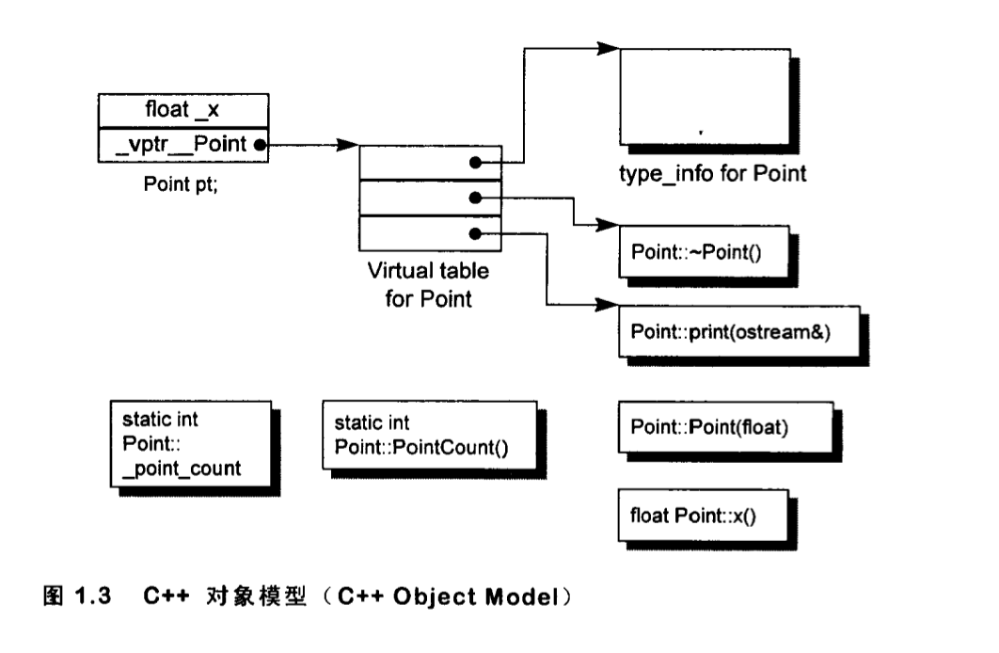

# C++对象模型

对 C++ 了解的人都应该知道虚函数（Virtual Function）是通过一张虚函数表（Virtual Table）来实现的，简称为V-Table。

在这个表中，存放的是一个类的虚函数的地址表，这张表解决了继承、覆盖的问题，保证其真实反应实际的函数。

这样，这个类的实例内存中都有一个虚函数表的指针，所以，当我们用父类的指针来操作一个子类的时候，这张虚函数表就显得由为重要了，它就像一个地图一样，指明了实际所应该调用的函数。

```C++
class Point {
public:
	Point(float xval ); 
	virtual ~Point();
	float x() const,
	static int PointCount();
protected:
	virtual ostream& print( ostream &os ) const;
	float _x;
	static int _point_count;
};
```

上述类的对象模型




# [**动态多态底层原理**](https://csguide.cn/cpp/object_oriented/virtual_function.html#%E5%8A%A8%E6%80%81%E5%A4%9A%E6%80%81%E5%BA%95%E5%B1%82%E5%8E%9F%E7%90%86)

在底层，当一个类声明一个虚函数时，编译器会为该类创建一个虚函数表（Virtual Table）。这个表存储着该类的虚函数指针，这些指针指向实际实现该虚函数的代码地址。

**在派生类中，如果重写了基类的虚函数，那么该函数在派生类的虚函数表中的地址会被更新为指向派生类中实际实现该函数的代码地址。**


C++的动态多态必须满足两个条件：

* **必须通过基类的指针或者引用调用虚函数**
* **被调用的函数是虚函数，且必须完成对基类虚函数的重写**

其中第一条很重要，当我们使用派生类的指针去访问/调用虚函数时，实际上并未发生动态多态，因为编译时就能确定对象类型为派生类型，然后直接生成调用派生类虚函数的代码即可，这种叫做 **静态绑定** 。

通过基类的指针或引用调用虚函数才能构成多态，因为这种情况下运行时才能确定对象的实际类型，这种称为**动态绑定。**
